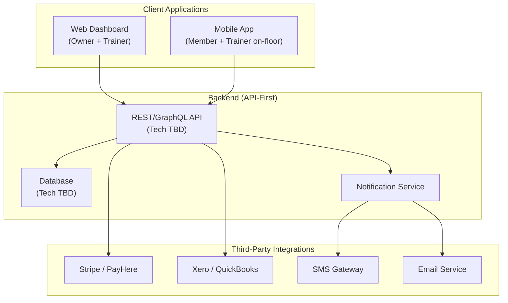
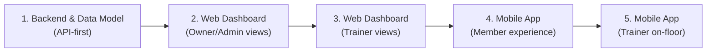
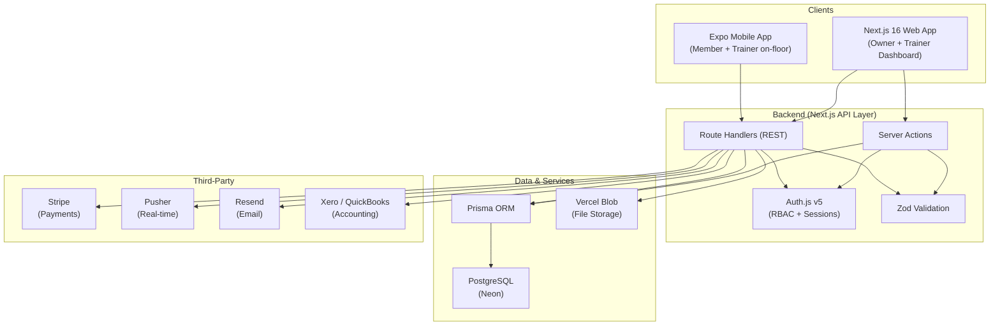

# GymOS — Complete Project Understanding

## What is GymOS?

GymOS is a **cloud-based, multi-tenant SaaS platform** for gym operators. It replaces manual, paper-based, and informal (WhatsApp-based) gym administration by unifying **Members**, **Personal Trainers**, and **Gym Owners** into a single digital ecosystem.

The platform automates the entire **Personal Training (PT) session lifecycle** — from booking to QR-based check-in/check-out, billing, trainer payroll, and financial reporting — all in real-time.

---

## Product Architecture

---

## Three-Phase Roadmap

| Phase | Timeline | Focus |
|-------|----------|-------|
| **Phase 1 — MVP** | Months 1–4 | Core operations: Auth, PT Session Tracker (QR), Private Trainer Hire, Owner Dashboard, Financials, Member App |
| **Phase 2 — Engagement** | Months 5–8 | Member Retention Engine, Gamification (streaks/badges/leaderboards), Public Trainer Marketplace |
| **Phase 3 — AI & Scale** | Months 9–12 | Biometric Access Control, Wearable Integration, AI Agent (coaching + business intelligence) |

---

## User Roles & Permissions (RBAC)

| Role | Access Scope | Key Capabilities |
|------|-------------|-------------------|
| **SuperAdmin** | All tenants (platform-wide) | Global access, platform billing, can act on any gym |
| **Gym Owner** | Their gym tenant only | Gym config, member/trainer CRUD, financials, analytics, plan management, pay rates |
| **Personal Trainer** | Their assigned clients only | Client management, workout/meal plan builder, session schedule, own earnings |
| **Gym Member** | Their own data only | Profile, book sessions, QR check-in, view plans, purchase memberships/packs |

---

## Phase 1 — Detailed Scope

### What's IN Phase 1

#### 1. Authentication
- Username/password login for all 4 roles
- Role-Based Access Control (RBAC) with strict tenant isolation

#### 2. Gym Setup & Configuration
- Gym profile configuration
- Membership plan creation
- Trainer pay rate setup (Level 1 vs Level 2 + off-shift premiums)
- Cancellation and no-show policy settings

#### 3. Member & Trainer Management
- Full CRUD for members and trainers
- Trainer shift schedules and level assignments
- Member status tracking (Active/Inactive/Expired)

#### 4. Private Trainer Hire
- Non-public, in-gym directory of available trainers
- Members send direct hire requests → Trainers accept/decline
- Creates a private trainer-client relationship

#### 5. PT Session Booking & Lifecycle
- Conflict-free scheduling with automated reminders
- **QR-Based Lifecycle**: Members scan QR to start and end sessions
- Automated enforcement of minimum session duration
- Late cancellation and no-show deduction rules
- Session statuses: Scheduled → Active → Completed / Missed / Cancelled

#### 6. Training & Nutrition Plans
- Trainers build personalized workout plans (exercises, sets, reps, notes)
- Trainers build meal plans (daily meals, macros, calories)
- Members can log solo workouts

#### 7. Financial Management & Billing
- In-app purchase/renewal of memberships and session packs (via Stripe/PayHere)
- Real-time revenue tracking (membership vs. PT sessions)
- Deferred revenue tracking & recognition
- Expense tracking with budget alerts
- Automated trainer pay calculation (L1/L2 rates × shift hours)
- On-demand P&L generation and payroll reporting
- Accounting export to Xero/QuickBooks

#### 8. Owner Analytics Dashboard
- Real-time live operations: occupancy, active sessions, today's revenue
- Trainer performance metrics
- Financial summaries

#### 9. In-App Messaging
- Direct messaging between members and their assigned trainers

### What's OUT of Phase 1

> These are explicitly deferred to Phases 2 & 3:
> - Biometric access control (face ID / fingerprint)
> - Public Trainer Marketplace (with reviews)
> - Member Retention Engine (churn scoring, re-engagement funnels)
> - Gamification (streaks, badges, leaderboards)
> - AI Agent (coaching chat, business intelligence)
> - Wearable integration (Apple Health, Garmin, WHOOP, etc.)

---

## Phase 1 — Screens (27 Total)

### Auth & Profiles
| ID | Screen | Platform |
|----|--------|----------|
| SCR-01 | Login | Web + Mobile |
| SCR-02 | Member Registration | Mobile |
| SCR-05 | Member Profile & Goals | Mobile |

### Member App
| ID | Screen | Platform |
|----|--------|----------|
| SCR-04 | Home / Dashboard | Mobile |
| SCR-06 | Session Attendance | Mobile |
| SCR-07 | Session Booking | Mobile |
| SCR-08 | QR Start/End | Mobile |
| SCR-09 | Workout Plan Viewer | Mobile |
| SCR-10 | Meal Plan Viewer | Mobile |
| SCR-12 | Direct Messaging | Mobile |
| SCR-15 | Billing & Payments | Mobile |
| SCR-30 | Hire a Trainer Directory | Mobile |

### Trainer Portal
| ID | Screen | Platform |
|----|--------|----------|
| SCR-16 | Daily Schedule | Web + Mobile |
| SCR-17 | Client Management | Web |
| SCR-18 | Client 360 Profile | Web |
| SCR-19 | Plan Builder (Workout + Meal) | Web |
| SCR-20 | Trainer Earnings | Web + Mobile |
| SCR-31 | Hire Request Review | Web + Mobile |

### Owner Dashboard
| ID | Screen | Platform |
|----|--------|----------|
| SCR-21 | Live Operations | Web |
| SCR-22 | Gym Configuration | Web |
| SCR-23 | Member Management | Web |
| SCR-24 | Trainer Management | Web |
| SCR-25 | PT Session Oversight | Web |
| SCR-26 | Financial Dashboard | Web |
| SCR-28 | Access Control / Audit Log | Web |
| SCR-29 | GymOS Subscription Management | Web |

---

## Phase 1 — Data Entities (21 Total)

Key entities and their critical fields:

| Entity | Key Fields |
|--------|-----------|
| **Member** | `member_id` (PK), name, phone, email, DOB, emergency contact, status (Active/Inactive/Expired), churn score |
| **Trainer** | `trainer_id` (PK), name, level (1/2), shift hours, specializations |
| **PT Session** | `session_id`, member_id, trainer_id, date, scheduled/actual times, status, pay rate, fee |
| **Session Pack** | `pack_id`, total sessions, used, purchase date, expiry |
| **Workout Plan** | Exercises, sets, reps, notes (linked to member + trainer) |
| **Meal Plan** | Daily meals, macros, calories (linked to member + trainer) |
| **Revenue Record** | Amount, type (membership/PT), date, deferred flag |
| **Expense Record** | Amount, category, date, budget linkage |
| **Deferred Revenue** | Pack balance tracking, recognition schedule |

---

## Phase 1 — Mandated Build Order

> The Web Dashboard is built **before** the Mobile App. Mobile-only features (like QR scanning) must be testable via backend/web-admin mocks until the Mobile App is ready.

---

## Business Model

| Revenue Stream | Description |
|---------------|-------------|
| **Platform (GymOS)** | Multi-tier SaaS subscription (Starter/Growth/Pro/Enterprise) paid by gym operators |
| **Gym Revenue** | Membership plans + prepaid PT Session Packs purchased by members |
| **Trainer Pay** | Percentage-of-fee model. L1/L2 base rates + off-shift premium for out-of-hours sessions |

---

## Finalized Tech Stack

> All decisions finalized — unified TypeScript ecosystem across all layers.

| Layer | Technology | Purpose |
|-------|-----------|---------|
| **Web Framework** | Next.js 16 (App Router) | Web dashboard + API backend (Server Actions + Route Handlers) |
| **Language** | TypeScript | Shared across all layers |
| **Styling** | Tailwind CSS 4 | Utility-first CSS, already set up |
| **UI Components** | shadcn/ui | Pre-built accessible components for the web dashboard |
| **ORM** | Prisma | Type-safe database access, migrations, schema-as-code |
| **Database** | PostgreSQL (via Neon) | Relational data, financial integrity, ACID transactions |
| **Auth** | NextAuth.js v5 (Auth.js) | RBAC, session management, credentials provider |
| **Hosting** | Vercel | Web app deployment, serverless functions, edge CDN |
| **Mobile** | Expo (React Native) | iOS + Android from one codebase, QR camera, push notifications |
| **Payments** | Stripe | Memberships, session packs, webhooks |
| **Real-time** | Pusher | Live dashboard, in-app messaging, session status updates |
| **Email** | Resend | Transactional emails, reminders, notifications |
| **Validation** | Zod | Shared schemas across web, mobile, and API |
| **File Storage** | Vercel Blob | Profile photos, plan attachments |

### Architecture Diagram

---

## Current Project State

The repository currently has a **fresh Next.js 16.3.0 scaffold** with:
- React 19.2.8
- TypeScript 5
- Tailwind CSS 4
- A single placeholder page (`Welcome to Gymos`)
- No backend, no database, no components, no routing — purely a blank canvas

---

## Open Questions / Risks Flagged in Documents

1. **Timeline Conflict**: The full proposal says Phase 1 = Months 1–4, but a separate FitCore business case references a 3-month MVP. Needs Product Owner confirmation.
2. **No Visual Design**: The SRS explicitly states no wireframes, mockups, or design system exist — only functional requirements per screen.
3. **WhatsApp Integration**: Mentioned in background business case but conflicts with the primary SRS spec. Needs clarification.
